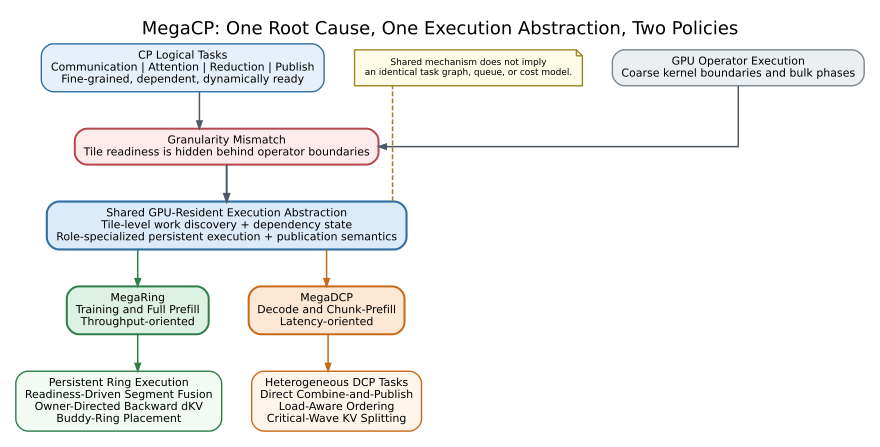
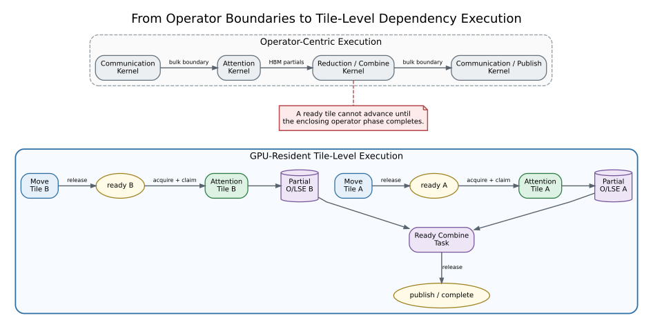
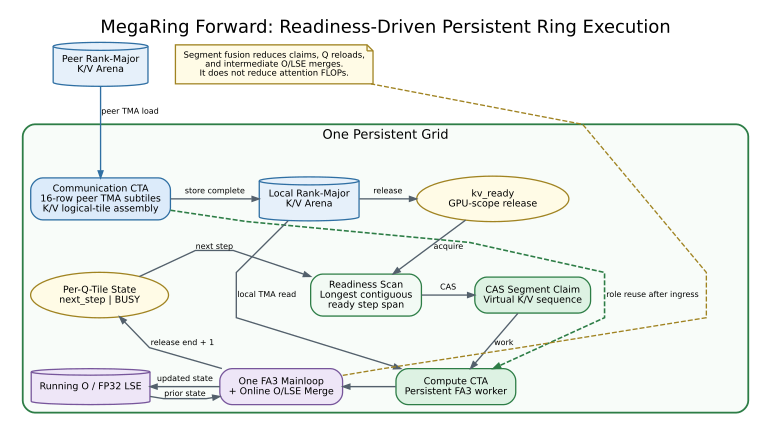
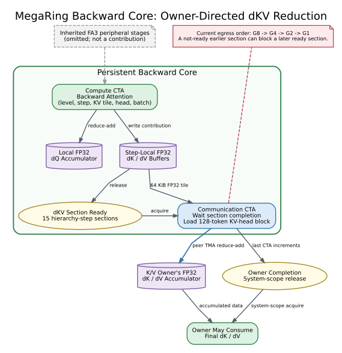
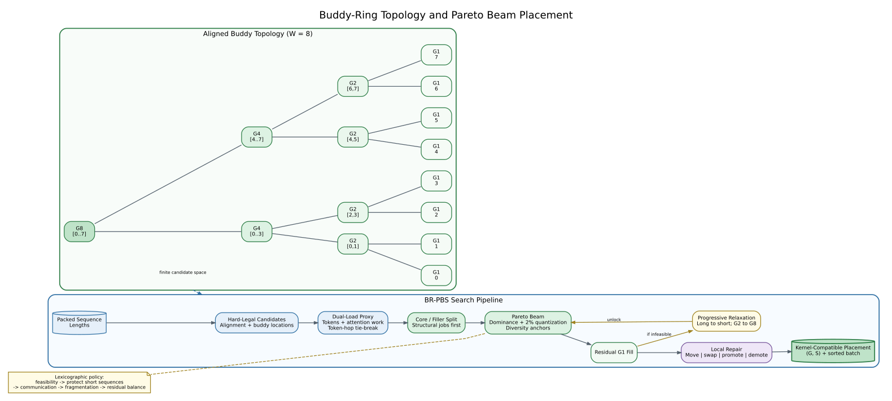
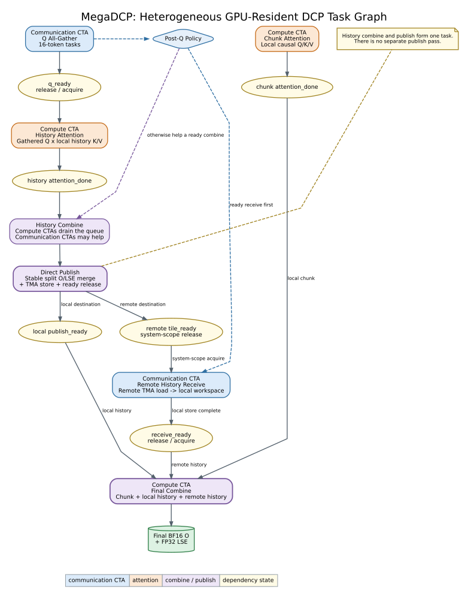
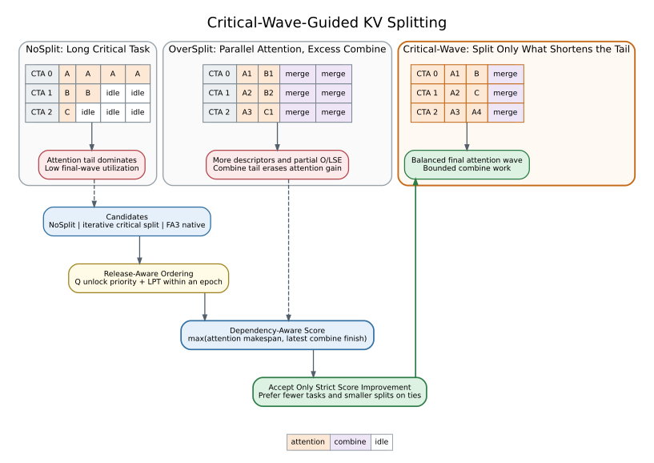

# MegaCP 论文撰写框架与技术底稿

> 文档定位：本文不是已经定稿的论文正文，而是一份可直接据此撰写论文的、与当前实现对齐的技术蓝图。它统一论文叙事、章节内容、公式、图表、实验问题、证据来源和表述边界。
>
> 命名约定：**MegaCP** 指论文提出的整体系统套件及共同执行抽象；**MegaRing** 指面向训练和 full prefill 的 throughput-oriented 实例；**MegaDCP** 指面向 decode 的 latency-oriented 实例。

---

## 0. 如何使用本文档

### 0.1 证据标签

全文使用四种标签区分事实、动机、测量和待办：

- **[CODE FACT]**：可以从当前源码、运行时 ABI 或已实现控制流直接确认，适合写入方法或实现章节。
- **[DESIGN RATIONALE]**：解释为何采用某项设计，但其本身不等于性能收益。
- **[MEASURED EVIDENCE]**：仓库中已有测量数据；引用时必须同时保留运行环境和计时边界。
- **[VALIDATION TODO]**：需要补实验、统一重测或正式文献检索后，才能写成论文结论。

写作时应把方法章节主要建立在 `[CODE FACT]` 上，用 `[DESIGN RATIONALE]` 解释选择，用受控实验把 `[VALIDATION TODO]` 转换成 `[MEASURED EVIDENCE]`。

### 0.2 全文不可改变的叙事边界

全文主线必须保持为：

```text
Different performance objectives
        |
        v
One common granularity mismatch
        |
        v
One shared execution abstraction
        |
        +----------------------------+
        |                            |
        v                            v
MegaRing                         MegaDCP
Throughput-oriented             Latency-oriented
```

共同点只统一到以下两层：

1. **共同根问题**：CP 的细粒度逻辑任务与 GPU 的粗粒度 operator execution 不匹配。
2. **共同执行抽象**：GPU-resident、tile-level、dependency-aware、role-specialized execution。

共同抽象不意味着：

- MegaRing 和 MegaDCP 使用相同的 task graph；
- 两者使用相同的 descriptor、queue 或 counter 实现；
- 两者共享统一的 makespan、cost model 或优化目标；
- Buddy-Ring、segment fusion 和 Critical-Wave 是同一个算法的不同部分；
- training/full prefill 与 decode 必须拥有相同数量的 Challenge、技术或相同章节长度。

### 0.3 必须避免的过度表述

| 不应使用的表述 | 准确表述 |
| --- | --- |
| MegaCP solves one unified optimization problem | MegaCP 提供共同执行抽象，两个实例使用不同的阶段性策略 |
| MegaRing and MegaDCP share the same task queue | 两者共享 GPU-resident work discovery 与 dependency state，但具体队列和状态机不同 |
| All CP communication is hidden | MegaCP 增加 tile-level overlap 机会；是否隐藏取决于 SM 配额、ready distance、带宽和执行尾部 |
| MegaRing reduces attention FLOPs through segment fusion | segment fusion 减少 claim、Q reload 和 O/LSE merge，不减少数学 FLOPs或唯一 KV tile 读取 |
| The entire backward is a single kernel | backward **core** 融合 attention、K/V ingress 和 dKV egress；继承的外围阶段不是本文贡献 |
| BR-PBS is globally optimal | BR-PBS 是受限 buddy topology 上的确定性启发式搜索 |
| Critical-Wave accurately predicts latency | Critical-Wave 是用于候选排序和保守筛选的无量纲关键波模型 |
| MegaCP outperforms native vLLM | 当前 baseline 是使用同一 local FA3 attention 的 vLLM-style orchestration，不代表完整原生 serving engine |
| WGMMA/TMA/online softmax are MegaCP innovations | 它们继承自 FA3/CUDA；MegaCP 的贡献是跨设备执行图、任务组织和调度 |

---

## 1. 论文标题、摘要和贡献

### 1.1 暂定标题

首选标题：

> **MegaCP: GPU-Resident Tile-Level Execution for Context Parallelism Across Training and Decode**

备选标题：

- **Breaking Operator Boundaries for Context Parallelism with GPU-Resident Tile Tasks**
- **MegaCP: Dependency-Aware GPU Execution for Throughput- and Latency-Oriented Context Parallelism**

首选标题的优点是直接覆盖训练和 decode，并把核心机制落在 GPU-resident tile-level execution 上；它不暗示两个阶段共享同一个优化模型。

### 1.2 摘要应完成的论证

摘要建议按四段逻辑压缩成一个自然段。

**第一部分：背景和目标差异。**

Context parallelism 被用于扩展长上下文训练、full prefill 和 decode。训练与 full prefill 追求 steady-state throughput，decode 追求单次迭代 latency，因此二者不能使用完全相同的调度目标。

**第二部分：共同根问题。**

CP 在逻辑上由 communication、attention、reduction/combine 和 completion/publish 等细粒度任务构成，这些任务具有 tile-level 粒度、显式 producer-consumer dependency 和动态 readiness。然而，现有系统通常通过多个独立 GPU operators 执行它们，导致底层依赖无法跨 operator boundary 被直接调度。

**第三部分：共同抽象和两个实例。**

MegaCP 提出 GPU-resident、tile-level、dependency-aware、role-specialized execution abstraction。MegaRing 为训练/full prefill 采用面向 throughput 的 persistent ring execution、readiness-driven segment fusion、backward owner-directed dKV reduction 和 Buddy-Ring placement；MegaDCP 为 decode 融合异构 DCP tasks，并通过 load-aware ordering 和 Critical-Wave KV splitting 控制执行尾部。

**第四部分：结果。**

最终摘要只填写统一受控实验得到的结果：

```text
[RESULT-TODO: MegaRing forward/full-prefill throughput improvement]
[RESULT-TODO: MegaRing backward throughput improvement]
[RESULT-TODO: MegaDCP decode-only p50/p99 latency reduction]
[RESULT-TODO: MegaDCP mixed-batch p50/p99 latency reduction]
```

不要把不同计时边界的旧日志数字拼成摘要 headline。

### 1.3 推荐贡献表述

贡献建议固定为三点。

1. **共同问题与执行抽象。** We identify a fundamental granularity mismatch between CP's fine-grained logical tasks and operator-centric GPU execution, and propose a GPU-resident, tile-level, dependency-aware, and role-specialized execution abstraction.
2. **MegaRing for training and full prefill.** We instantiate the abstraction for throughput-oriented workloads with role-specialized persistent ring execution, readiness-driven causal segment fusion, owner-directed backward dKV reduction, and Buddy-Ring packed-workload placement.
3. **MegaDCP for decode.** We instantiate the abstraction for latency-oriented decode by fusing heterogeneous DCP tasks and using dependency-aware ordering and Critical-Wave-guided KV splitting to reduce the iteration tail.

其中第二点必须将 backward 写成 **owner-directed backward dKV reduction** 或 **backward core execution**，不能写成“single-kernel backward”。

---

## 2. Introduction

### 2.1 本节目标

Introduction 只完成“为什么需要这篇论文”和“论文提供了什么”的闭环，不在这里展开 Buddy-Ring 或 Critical-Wave 的公式。

### 2.2 推荐段落结构

#### 第 1 段：CP 的重要性

说明长上下文使单卡存储与计算不可持续，CP 将序列维度工作分布到多个 GPU，因而同时影响训练、full prefill 和 decode。指出三者虽然都执行 attention，但运行形态不同。

#### 第 2 段：目标差异

训练/full prefill 具有大计算量和较长 steady state，核心目标是高吞吐、通信计算重叠和最慢 rank 的负载控制。Decode 的 query 很短，单次 iteration 常由 launch、数据搬运、CTA wave 和执行尾部主导，核心目标是 latency。

#### 第 3 段：共同根问题

建议使用以下逻辑：

> Context parallelism is logically composed of fine-grained communication, attention, reduction, and publication tasks. These tasks expose tile-level producer-consumer dependencies and become ready at different times. Existing implementations, however, commonly execute them through coarse-grained GPU operators. The operator boundary hides tile readiness from the GPU scheduler and forces logically independent work to advance in bulk phases.

这里的关键词是 **granularity mismatch**，不是“所有系统都没有 overlap”。许多 baseline 已经使用 stream、CUDA Graph 或 collective overlap；本文批评的是 operator boundary 对 tile-level dependency 的表达能力限制。

#### 第 4 段：不同表现

训练/full prefill：

- communication kernel 和 attention kernel 竞争 SM 或被迫分阶段执行；
- 每个 ring step 可能产生额外 launch、Q reload 和 O/LSE merge；
- packed sequence 的负载分配同时受到 token、二次 attention work 和 kernel alignment 约束；
- backward 的 dKV contribution 需要归还 owner，独立 materialization/collective 会扩大中间状态边界。

Decode：

- 多个短 kernel 的 launch/front-end cost 更突出；
- partial O/LSE 在不同 operator 间经过 HBM；
- KV split 增加 attention parallelism的同时扩大 combine work；
- FIFO ordering 和离散 CTA wave 可能把重任务留到最后一波。

#### 第 5 段：MegaCP

提出共同抽象：

> MegaCP keeps CP execution resident on the GPU and represents progress through tile-level work discovery and dependency state. Role-specialized CTAs perform communication and attention-related work, while acquire/release completion signals allow dependent tasks to proceed when their input tiles become visible, rather than only at operator boundaries.

注意使用 **work discovery and dependency state**，不要声称两个实例共享完全相同的 queue。

#### 第 6 段：MegaRing

概括：

- rank-major K/V arena；
- communication/compute CTA specialization；
- tile readiness；
- causal segment fusion；
- forward role reuse；
- backward step-local dKV 与 owner-directed reduce-add；
- BR-PBS placement。

#### 第 7 段：MegaDCP

概括：

- chunk/history attention；
- Q load、attention、history combine、remote receive 和 final combine 的异构 task graph；
- GPU dependency state；
- direct publish；
- load-aware ordering；
- Critical-Wave split。

#### 第 8 段：贡献与结果

使用三点贡献，填入统一实验结果。

### 2.3 Introduction 主图



**图注候选：** MegaCP addresses a common granularity mismatch between CP's tile-level logical tasks and operator-centric GPU execution. MegaRing and MegaDCP share a GPU-resident dependency-aware execution abstraction but use distinct task organizations and scheduling policies for throughput- and latency-oriented workloads.

---

## 3. Background and Motivation

### 3.1 Context Parallelism for Training and Full Prefill

#### 应写入的基础过程

对于 world size (W)，每条序列的 Q/K/V 沿 context 维度分片。一个 rank 保留 local Q，并通过 ring 或其他通信方式获得 remote K/V。每次 attention 产生局部 (O) 和 LSE contribution，随后用数值稳定的 online-softmax recurrence 合并。

packed workload 中，sequence (i) 用三元组表示：

\[
(L_i,G_i,S_i),
\]

其中 (L_i) 是 global sequence length，(G_i) 是该序列的 CP/ring size，(S_i) 是 aligned ring start。对于 rank (r) 和 step (s)，MegaRing 中的 K/V owner 为：

\[
owner(G,r,s)=
\left\lfloor\frac{r}{G}\right\rfloor G+
(r\bmod G-s+G)\bmod G.
\]

**[CODE FACT]** aligned buddy topology 使 owner 只依赖 (G,r,s)，device hot path 不需要查询通用 rank-group table。

#### 为什么 token balance 不够

一个 causal sequence 的 attention work 近似为：

\[
A_i=\frac{L_i(L_i+1)}{2},
\]

noncausal work 近似为：

\[
A_i=L_i^2.
\]

因此两个 placement 即使每个 rank 的 token 数相同，也可能具有不同的 attention work。真实 kernel 还受到 BlockM/BlockN 离散化、causal zigzag、head 数和 ready timing 影响，所以 (A_i) 只能作为 planner proxy。

#### Backward 背景的写作边界

只说明 backward 会产生：

- 多个 K/V tile 和 ring step 对同一 Q 的 dQ contribution；
- 每个 remote K/V owner 对应的 dK/dV contribution；
- 跨 CTA、跨 rank 的累加与完成依赖。

不要在 background 详细介绍 FA3 既有 pre/post process；方法章节只突出 MegaRing 新的 step-local dKV 和 owner-directed reduction。

### 3.2 Context Parallelism for Decode

MegaDCP 将一次 packed-varlen chunk/decode batch 分成两个 attention domains：

1. **Chunk attention**：local Q 对本 rank chunk K/V 执行 causal attention。
2. **History attention**：DCP group 聚合后的 Q 对本 rank history K/V 执行 noncausal attention。

最终输出需要合并：

```text
local causal chunk contribution
+ local noncausal history contribution
+ remote noncausal history contributions
```

decode batch 可能同时包含短 decode query、较长 chunk query、差异明显的 history length 以及不同数量的 M-block、N-block 和 split partial。总 FLOPs相近不代表最后一个 CTA wave 的完成时间相近。

### 3.3 Logical Tasks versus Operator Execution



传统 operator-centric 路径常表现为：

```text
Communication kernel
    -> Attention kernel
    -> Reduction/combine kernel
    -> Communication/publication kernel
```

而逻辑任务实际是：

```text
data tile ready
    -> attention tile
    -> partial O/LSE or gradient
    -> dependent combine/reduce
    -> completion/publication
```

需要在正文中明确四类不匹配：

| 不匹配 | operator-centric 后果 |
| --- | --- |
| task granularity | 一个 ready tile不能单独推进，必须等待整批 operator |
| dependency visibility | producer-consumer dependency被 host launch或kernel boundary间接表达 |
| resource specialization | communication和compute的资源配额难以随阶段/尾部复用 |
| completion boundary | partial O/LSE、gradient和ready state在HBM或operator间重复 materialize |

### 3.4 Training/Full-Prefill Motivation

需要用实验回答：

- ring-step boundary 导致多少 launch、Q load 和 O/LSE merge？
- communication领先多个 step 时，是否可以一次消费连续 ready segments？
- 固定 communication SM 配额在 communication tail结束后浪费多少资源？
- packed workload的 token、attention proxy和真实 max-rank latency是否一致？
- backward独立 dKV collective相对于 owner-directed egress的成本是多少？

### 3.5 Decode Motivation

需要用实验回答：

- eager、CUDA Graph、persistent kernel的GPU-visible和host-visible overhead分别是多少？
- split从 1 增加到较大值时，attention makespan、descriptor数和combine work如何变化？
- FIFO是否把长 history task留在最后一个wave？
- decode-only与mixed batch是否应使用相同排序？
- `num_comm_sm`变化如何改变Q readiness、receive与compute资源？

---

## 4. MegaCP Overview

### 4.1 共同执行抽象

MegaCP 的概念性 task 可以写为：

```text
Task {
    type
    tile coordinates
    readiness predicate
    eligible resource role
    output location
    completion/publication action
}
```

**[DESIGN RATIONALE]** 这是论文的逻辑抽象，不要求两个实例共享同一个 C++ struct 或同一套 queue ABI。

### 4.2 共同生命周期和内存顺序

```text
producer creates/moves a tile
    -> the store becomes visible
    -> producer releases readiness/completion
    -> consumer acquire-observes the state
    -> consumer claims dependent tile work
    -> consumer executes
    -> consumer publishes successor state
```

共同 insight 不是“所有操作塞进一个 kernel”，而是让数据可见性、任务 readiness 和资源角色在 GPU 内直接驱动执行。

### 4.3 两种具体实例化

| 维度 | MegaRing | MegaDCP |
| --- | --- | --- |
| 性能目标 | steady-state throughput | per-iteration latency |
| work discovery | persistent ticket、readiness scan、per-Q-tile state | attention/combine/final descriptors与atomic counters |
| 通信对象 | ring K/V；backward dKV | gathered Q；history O/LSE |
| 主要 reduction | online O/LSE；owner dKV reduce-add | history combine；final combine |
| 主要尾部 | slow rank、communication/compute tail | final CTA wave、combine/receive tail |
| 资源复用 | forward comm CTA完成ingress后加入compute pool | comm CTA在post-Q阶段协助ready history combine |
| 阶段策略 | segment fusion、BR-PBS | release-aware ordering、Critical-Wave |

### 4.4 共同 correctness contract

方法章节需要用 happens-before 而不是“等一下就可以读”来描述正确性。

MegaRing forward：

```text
peer TMA load
    -> local-HBM TMA store complete
    -> GPU-scope release kv_ready
    -> acquire readiness scan/wait
    -> local-HBM attention read
```

MegaRing segment state：

```text
segment O/LSE store
    -> release tile_state = next_step
    -> acquire/CAS next segment claim
    -> read prior running O/LSE
```

MegaDCP：

```text
Q all-gather store
    -> q_ready
    -> history attention_done
    -> history combine + publish
    -> tile_ready / publish_ready
    -> receive_ready
    -> final combine
```

---

## 5. MegaRing for Training and Full Prefill

### 5.1 Design Goals and Challenges

**Challenge 1：communication-computation coordination。** 如何让 remote K/V 一旦达到 attention tile 可消费粒度，compute 就能推进，同时控制 communication CTA 和 attention CTA 的 SM 资源竞争。

**Challenge 2：fine-grained scheduling efficiency。** tile-level readiness增加灵活性，但会增加 task claim、Q reload、partial O/LSE writeback和online merge。

**Challenge 3：packed-workload placement。** CP degree和placement必须同时考虑负载、通信、split overhead、alignment和kernel regularity。

**Challenge 4：backward gradient ownership。** dQ和dKV具有不同归属；dKV contribution需要回到K/V owner，并需要跨rank完成语义。

这四项是实际设计问题，不需要强行归纳成一个统一数学挑战。

### 5.2 Buddy-Ring Topology and Planner-Kernel Contract

对于 (W=8)，合法位置构成 buddy tree：

```text
G8: [0..7]
G4: [0..3] [4..7]
G2: [0,1] [2,3] [4,5] [6,7]
G1: [0] [1] [2] [3] [4] [5] [6] [7]
```

合法 placement 满足：

\[
S_i\bmod G_i=0,\qquad S_i+G_i\le W,\qquad L_i\bmod G_i=0.
\]

**[CODE FACT]** kernel/host 使用固定 G8/G4/G2/G1 descriptor，而不是任意 group object。batch 必须按 descending ring size、ascending ring start、original index 重排，使每个 level拥有连续 batch/row range。

**[CODE FACT]** causal planner使用更强的对齐约束 (L\bmod(256G)=0)，确保local half能够128-row对齐。noncausal planner只保证topology可分，最终仍需要binding检查local shard 128-row alignment。

planner-kernel contract：

| Planner/host决策 | Kernel消费方式 | 作用 |
| --- | --- | --- |
| aligned `(G,S)` | `owner(G,r,s)`恢复source rank | 避免通用topology lookup |
| ring-size sorted batch | fixed level batch/row ranges | 简化tile decode |
| causal alignment | front/back half与BlockN对齐 | 支持zigzag和segment mapping |
| rank-local packed lengths | prepared varlen metadata | 支持empty membership |
| rank-major capacity | source-rank arithmetic | peer ingress后本地复用 |

### 5.3 Rank-Major K/V Arena

布局：

```text
q, o, dout, dq:
    [local_total_q, QH, 128]

k, v:
    [W * rank_kv_capacity, KVH, 128]

owner-local region of rank r:
    [r * rank_kv_capacity, (r + 1) * rank_kv_capacity)
```

source row address：

```text
source_rank * rank_kv_capacity + compact_row
```

**[CODE FACT]** `rank_kv_capacity` 为128 rows的倍数，host验证local packed total不超过capacity。

数据路径：

```text
peer HBM
    -> communication CTA shared-memory staging
    -> local rank-major K/V arena
    -> FA3 local-HBM TMA
    -> shared memory / WGMMA
```

**[DESIGN RATIONALE]** remote K/V只做一次跨设备ingress，然后被多个Q tiles/GQA heads在本地复用。代价是多一次local HBM store/read，净收益必须由NVLink/HBM profiler和reuse实验验证。

### 5.4 Persistent CTA Roles



forward grid：

```text
grid.x = num_comp_sm + num_comm_sm

blockIdx.x in [0, num_comp_sm):
    initial compute CTAs

blockIdx.x in [num_comp_sm, grid.x):
    communication CTAs
```

**[CODE FACT]** launch dynamic shared memory取FA3 compute需求和communication staging需求的最大值，因此同一个persistent CTA完成communication phase后能够复用block资源执行attention。

**[CODE FACT]** initial compute CTA使用静态work id；后续工作来自global work counter。communication CTA完成自己的strided ingress后，以`start_from_work_queue=true`加入attention work pool。

准确解释：

- role conversion是同一persistent CTA的phase reuse；
- 它不是CTA从一个物理SM迁移到另一个物理SM；
- 每个communication CTA可以独立转入compute，无需等待全部communication CTA；
- backward communication CTA还需执行dKV egress，因此不做同样的forward role conversion。

### 5.5 Logical Attention Tile and Physical TMA Subtile

| 模式 | Logical K/V task | Physical TMA transfer |
| --- | ---: | ---: |
| causal forward | 128 token rows | `16 × 1024` BF16 |
| noncausal forward | 176 token rows | `16 × 1024` BF16 |
| causal backward ingress | 128 token rows | `16 × 1024` BF16 |
| backward dK/dV egress | 128-token KV-head block | `16 × 1024` FP32 reduce-add |

**[CODE FACT]** readiness对应完整logical attention tile，而不是单个16-row transfer。一个target计数包括K和V各自的logical task：

\[
ready\_target=2\left\lceil\frac{rows}{BlockN}\right\rceil.
\]

load/store warp-pair protocol：

```text
load warp:
    wait slot reusable
    -> peer-global to shared TMA

store warp:
    wait shared arrival
    -> shared to local arena TMA
    -> wait shared slot reusable
    -> wait local global store complete
    -> release kv_ready
```

只有最后一个`store complete -> release kv_ready`建立compute可以读取local HBM的happens-before。shared slot可重用不等价于global destination已对consumer可见。

causal half-KV task使用`half_cu_seqlens`把compact half-row映射回full K/V arena，避免独立half arena。

### 5.6 Causal Zigzag

令 (r_G) 为subring-local rank：

```text
step 0:
    full local Q x full local KV
    diagonal causal mask

step 1 .. r_G:
    full local Q x remote front-half KV
    no diagonal mask

step r_G + 1 .. G - 1:
    local back-half Q x remote full KV
    no diagonal mask
```

front Q tile在(r_G)后终止，back Q tile推进到(G-1)。该规则覆盖global causal attention pair，并提供较均衡的有效attention area。

### 5.7 Per-Q-Tile State and Readiness-Driven Segment Fusion

每个full Q tile拥有一个state：

```text
low bits:
    next unprocessed ring step

high BUSY bit:
    this tile is currently claimed
```

状态转移：

```text
state = 0
    -> step-0 writes initial O/LSE
    -> release state = 1
    -> scan consecutive ready steps [begin, end]
    -> CAS(state, state | BUSY)
    -> execute one virtual K/V segment
    -> online merge once
    -> release state = end + 1
```

segment claim算法：

```text
begin = tile_state.next_step
end = begin - 1

for step in [begin, last_step]:
    if kv_ready(step) has not reached its target:
        break
    end = step

if end >= begin:
    try CAS claim
```

FA3 mainloop将span视为一个virtual contiguous K/V sequence，并用整数运算恢复：

```text
(ring_step, source_rank, source-local n_block)
```

无需materialize拼接K/V。

若(s)个remote steps被分成(c)个segments，(1\le c\le s)：

- attention数学FLOPs不变；
- 唯一KV block read数量不变；
- scheduler claim从(s)次降到(c)次；
- Q load、prologue/epilogue和intermediate O/LSE merge从逐step降到逐segment；
- communication只领先一个step时自动退化为single-step；
- 当前只用于causal forward，noncausal是exact-step replay。

### 5.8 Online O/LSE Merge

已有running state ((O_p,L_p))，新segment为((O_b,L_b))：

\[
L=\log(\exp L_p+\exp L_b),
\]

\[
\alpha=\frac{\exp L_b}{\exp L_p+\exp L_b},
\]

\[
O=O_p+\alpha(O_b-O_p).
\]

需要说明：

- partial output不能简单相加；
- LSE使用FP32；
- remote step如果因mask没有有效K/V，不能覆盖已有running state；
- terminal completion只在所有有效segments完成后发布；
- `tile_state`的release/acquire保证下一个owner观察到prior O/LSE store。

### 5.9 Backward-Specific Execution



本节只写MegaRing引入的backward execution，不展开继承的外围阶段。

#### dQ

不同KV tiles和ring steps对同一local Q产生多个dQ contribution。compute CTA将其reduce-add到local FP32 `dq_accum`，避免过早转换为BF16。

#### Step-local dKV

core kernel使用：

```text
dk_steps, dv_steps:
    [world_size, step_stride]

step_stride:
    KVH * padded_rank_capacity * 128 floats
```

每个compute ticket精确表示：

```text
(hierarchy level, ring step, KV tile, Q head, batch)
```

compute epilogue写入对应step-local FP32 dK/dV，并更新该section的local readiness。

#### Owner-directed reduce-add

backward有15个local dKV readiness sections：

```text
G8 step 0..7: 8 sections
G4 step 0..3: 4 sections
G2 step 0..1: 2 sections
G1 step 0:    1 section
```

communication CTA等待一个section的所有local compute tiles完成，再把一个KV head的128-token FP32 block通过peer TMA reduce-add写到：

```text
owner(G, r, step) accumulator
```

一个`16 × 1024` FP32 tile为64 KiB。

最后完成该target section的CTA对owner completion scalar执行system-scope release increment；owner侧使用system-scope acquire等待期望贡献数。

#### 正确性和边界

- dKV egress不能早于对应section所有local tile完成；
- owner只能在所有peer contribution到达后消费accumulator；
- 每轮调用前必须清零owner accumulator和completion state并满足跨rank同步要求；
- backward没有forward multi-segment claim；
- backward communication CTA不会在ingress后转compute；
- 当前浮点累加顺序不固定，因此属于non-deterministic specialization；
- 当前dKV egress按G8→G4→G2→G1推进，前序section未ready时会阻塞后续ready section。

最后一项应作为清晰的当前tradeoff和未来优化空间，不能写成readiness-optimal scheduler。

### 5.10 Buddy-Ring Pareto Beam Search



#### 双负载模型

placement到size (G) ring后，member rank获得：

\[
t_{i,G}=\frac{L_i}{G},\qquad c_{i,G}=\frac{A_i}{G}.
\]

目标均值：

\[
\bar T=\frac{\sum_iL_i}{W},\qquad
\bar C=\frac{\sum_iA_i}{W}.
\]

最大相对偏差：

\[
D_T=\max_r\left|T_r/\bar T-1\right|,
\]

\[
D_C=\max_r\left|C_r/\bar C-1\right|.
\]

communication token-hop proxy：

\[
q_{i,G}=
\begin{cases}
0,&G=1,\\
L_i(G-1)/G,&G>1.
\end{cases}
\]

它不是byte、congestion或latency模型。

#### 目标优先级

给定token/compute tolerance，首先最小化违反量，再按长度bucket保护短序列，之后考虑communication、active locations和残余deviation。使用字典序而非把所有目标压成一个权重和。

#### 搜索流程

1. 计算每条sequence的hard-legal ring candidates。
2. 根据结构强度和最小必要ring size区分structural jobs与fillers。
3. 长/重structural jobs进入Pareto beam。
4. 使用prefix overload、spread、split、communication和active locations进行dominance过滤。
5. 对rank load保留rank identity并做2%量化合并。
6. beam过宽时保留多目标anchors和crowding diversity。
7. fillers使用G1 residual greedy fill。
8. 从长序列到短序列、从小ring到大ring做progressive relaxation。
9. 用move/swap/promotion/demotion等受限邻域做local repair。

#### 可主张和不可主张的内容

可以主张：

- planner在有限buddy tree上联合考虑token和attention proxy；
- short-sequence protection具有明确优先级；
- placement直接生成kernel-friendly fixed hierarchy；
- tie-break和搜索是确定性的。

不能主张：

- 全局最优；
- 对任意world size适用；
- proxy等价于真实kernel latency；
- planner单独保证所有noncausal launch alignment。

---

## 6. MegaDCP for Decode

### 6.1 Design Goals and Challenges

**Challenge 1：heterogeneous dependent task execution。** remote Q load、chunk/history attention、history combine、remote history receive和final combine的执行粒度、资源需求与依赖不同。

**Challenge 2：KV split/order与执行尾部。** split提高attention并行度，但增加descriptor、partial O/LSE和combine work；task order决定重任务是否落入最后一波。

### 6.2 Task Types and Dependency State

| Descriptor/signal | 粒度 | 作用 |
| --- | --- | --- |
| `AttentionWorkDesc` | sequence × packed-Q block × split | chunk或history attention |
| `QTaskDesc` | source rank × 16 tokens | 把Q搬到`q_group` |
| `PublishWorkDesc` | destination rank × token/head vectors | history combine + direct publish |
| `FinalWorkDesc` | final token/head vectors | final combine |
| `q_ready` | 16-token block | gathered Q可被history attention读取 |
| `attention_done` | attention descriptor | attention partial完成 |
| `publish_ready` | local publish tile | local history contribution完成 |
| `tile_ready` | source rank × remote tile | remote history tile已发布 |
| `receive_ready` | final tile × remote source | remote tile已落入local workspace |

依赖图：

```text
q_ready
    -> history attention_done
    -> history combine + direct publish
    -> publish_ready / tile_ready
    -> receive_ready
    -> final combine
```

### 6.3 Fused Heterogeneous Execution



#### Communication CTA

```text
Q all-gather
    -> post-Q loop
        -> prioritize ready remote receives
        -> otherwise try a ready history-combine task
        -> repeat until receive/combine completion condition
```

**[CODE FACT]** communication CTA不初始化FA3 attention pipeline。

**[CODE FACT]** history combine helper先查看队首ticket和dependencies，只有ready才CAS消费；它当前不越过未ready队首扫描后续任务，因此可能有head-of-line blocking。

#### Compute CTA

```text
unified chunk/history attention scheduler
    -> CTA-wide phase transition
    -> drain remaining history-combine work
    -> final combine
```

chunk descriptor无Q dependency；history descriptor等待覆盖其有效packed Q rows的`q_ready`。

### 6.4 History Combine and Direct Publish

对一个`PublishWorkDesc`：

1. 等待所需history `attention_done` IDs；
2. 读取该sequence的实际split数量和partial O/LSE；
3. 使用stable LSE-weighted recurrence合并；
4. 把BF16 O写入shared communication tile，把FP32 LSE写入send workspace；
5. 发起local/remote TMA store；
6. 等待remote-visible store完成；
7. local destination发布`publish_ready`，remote destination发布system-scope `tile_ready`。

**[CODE FACT]** 没有独立publish pass；history combine、TMA store和ready publication是一个task。`history_combine_done`和`publish_done`可以是同一完成语义，不能在论文时间分解中画成两个独立执行阶段。

### 6.5 Receive and Final Combine

receiver：

1. acquire-observe source `tile_ready` phase；
2. 读取remote history LSE；
3. remote TMA load history O到shared；
4. TMA store到local receive workspace；
5. 确认local store可见；
6. release `receive_ready`。

final combine等待：

- local chunk `attention_done`；
- local history `publish_ready`；
- all remote `receive_ready`。

然后合并local chunk、local history和remote history contributions。tail由`valid_vectors`限制，不能写出有效packed output范围。

### 6.6 Heterogeneous Granularity

当前实现中的典型粒度：

- attention：sequence × 128 packed-Q rows × split；
- Q communication：source rank × 16 tokens；
- history publication：destination × 16-token/head vector region；
- final combine：根据metadata选择4/8/16-token等有效vector粒度；
- attention BlockN：128或176。

论文应强调：异构粒度不是“一个万能tile shape”，而是不同task type各自采用适合communication、attention或combine的粒度，并通过dependency state连接。

### 6.7 Load-Aware Q and History Ordering

对每个history descriptor，把work平均分给依赖Q blocks：

\[
unlock\_work[q]\mathrel{+}=
\frac{attention\_work}{dependency\_count}.
\]

Q task按：

```text
(-unlock_work, original_q_block_id)
```

排序，优先传输可解锁更多attention work的Q block。

根据Q position定义离散release epoch：

```text
release_position = max(q_position[dependency])
q_counters_per_epoch = max(1, num_comm_sm // dcp_size)
release_epoch = release_position // q_counters_per_epoch
```

history descriptors按：

```text
(release_epoch,
 -attention_work,
 batch_idx,
 m_block,
 split_idx,
 completion_id)
```

排序。

解释：

- 不跨越release epoch假装依赖已满足；
- 同epoch内先放长任务，减少最后wave的重任务；
- 所有tie-break包含稳定坐标；
- cost model和最终metadata必须使用同一顺序；
- decode-only和mixed batch默认策略可以不同。

### 6.8 Critical-Wave-Guided KV Splitting



#### Attention task model

history N-block数：

\[
n_i=\left\lceil\frac{history\_len_i}{BlockN}\right\rceil.
\]

descriptor work使用无量纲模型：

```text
attention_work = n_blocks_in_split + attention_task_overhead
```

当前设计中固定overhead用于近似claim、pipeline启动和短task固定成本，不是微秒标定。

CTA list scheduling：

```text
for descriptor in final metadata order:
    cta = least_loaded_cta
    start = cta.load
    finish = start + attention_work
    cta.load = finish
    record completion_id finish
```

#### Dependent combine model

combine task需要等待它读取的全部attention completion IDs。每个compute CTA提供若干combine workers，worker只在该CTA完成attention后可用：

```text
start = max(worker_available, dependency_ready)
finish = start + combine_work
```

总score：

\[
score=\max(attention\_makespan,latest\_combine\_finish).
\]

#### Candidate search

始终保留：

- NoSplit candidate；
- iterative Critical-Wave candidate；
- FA3 native dynamic split candidate（若允许）。

迭代：

1. 找出当前makespan CTA最后处理的critical history sequences；
2. 对仍可拆分的critical sequence增加一个split；
3. 如果多条并列critical sequence形成plateau，加入联合增加split的候选；
4. 用完整attention+combine score评价；
5. 仅在score严格下降时接受；
6. score相同时偏好更短attention makespan、更少descriptor、更小split总和；
7. 相对NoSplit收益达到保守门槛后才实际启用split。

#### BlockN policy

auto policy需要避免循环依赖：

- 用规范BlockN评估Critical-Wave；
- 最终NoSplit偏向BlockN=176；
- split plan使用BlockN=128；
- 显式BlockN选项同时固定模型和dispatch。

#### 模型边界

Critical-Wave未完整建模：

- 真实Q-ready timestamp；
- HBM/L2 contention和cache reuse；
- TMA pipeline；
- atomic claim非确定性；
- receive、remote publication和final combine的全部cycle；
- BlockN在不同长度下的实测throughput曲线。

所以它适合排序候选和过滤收益不足的split，不适合输出绝对latency。

---

## 7. Implementation

### 7.1 支持范围

| 项目 | MegaRing | MegaDCP |
| --- | --- | --- |
| GPU | Hopper SM90 | Hopper SM90 |
| dtype | BF16 I/O、FP32 accumulation | BF16 I/O、FP32 partial/combine |
| head dim | 128 | 128 |
| device degree | 2/4/8 | DCP 2/4/8 |
| forward | causal/noncausal | packed-varlen chunk/decode |
| backward | causal、non-deterministic | 不支持 |
| GQA/MQA | `QH % KVH == 0`，受通信行宽约束 | 当前模板受`Hq_local`/`Hkv_group`约束 |
| transport | single-node CUDA IPC / peer TMA | single-node CUDA IPC / peer TMA |

### 7.2 继承与原创边界

继承自裁剪FA3：

- SM90 WGMMA；
- TMA pipeline；
- warp-specialized producer/consumer；
- online softmax math；
- varlen prepared scheduler基础；
- 基础split-combine数学。

MegaCP工作集中在：

- 跨设备task graph重组；
- persistent communication/compute roles；
- readiness和completion协议；
- MegaRing hierarchy、segment claim、role reuse和owner dKV；
- BR-PBS placement；
- MegaDCP异构task execution、direct publish、ordering和Critical-Wave。

### 7.3 资源和ABI细节

实现章节应报告：

- CTA数、warp数和dynamic shared-memory上限；
- `num_comp_sm:num_comm_sm`；
- BlockM/BlockN；
- rank-major capacity和对齐；
- metadata构造位置和大小；
- workspace状态是否需要每轮reset；
- CUDA Graph capture/replay覆盖范围；
- PDL若启用，明确其为继承的CUDA/FA3 launch能力而非独立贡献；
- empty rank、tail和OOB处理；
- device pointer、IPC allocation和TMA descriptor alignment。

### 7.4 主要实现映射

| 机制 | 路径 |
| --- | --- |
| MegaRing forward launch与communication CTA | [`../include/mega_ring_min_fa3_varlen_ring_launch.h`](../include/mega_ring_min_fa3_varlen_ring_launch.h) |
| MegaRing readiness scan与segment claim | [`../include/mega_ring_min_fa3_varlen_scheduler.h`](../include/mega_ring_min_fa3_varlen_scheduler.h) |
| fixed hierarchy descriptor | [`../include/min_fa3_mega_ring_hierarchy.h`](../include/min_fa3_mega_ring_hierarchy.h) |
| virtual N-block mapping | [`../include/min_fa3_mainloop.h`](../include/min_fa3_mainloop.h) |
| online O/LSE epilogue | [`../include/min_fa3_epilogue.h`](../include/min_fa3_epilogue.h) |
| MegaRing host binding | [`../csrc/mega_ring_min_fa3_varlen_ring_bindings.cu`](../csrc/mega_ring_min_fa3_varlen_ring_bindings.cu) |
| backward core与dKV egress | [`../include/backward/min_fa3_bwd_launch.h`](../include/backward/min_fa3_bwd_launch.h) |
| backward技术契约 | [`../docs/HIERARCHICAL_HYBRID_MEGA_RING_BACKWARD_DESIGN.md`](../docs/HIERARCHICAL_HYBRID_MEGA_RING_BACKWARD_DESIGN.md) |
| BR-PBS | [`../balancer/load_balancer.py`](../balancer/load_balancer.py) |
| BR-PBS设计说明 | [`../balancer/design.md`](../balancer/design.md) |
| MegaDCP metadata与Critical-Wave | [`../dcp_mega_metadata.py`](../dcp_mega_metadata.py) |
| MegaDCP device scheduler | [`../include/dcp_mega_min_fa3_varlen_scheduler.h`](../include/dcp_mega_min_fa3_varlen_scheduler.h) |
| MegaDCP persistent launch与combine | [`../include/dcp_mega_min_fa3_varlen_launch.h`](../include/dcp_mega_min_fa3_varlen_launch.h) |
| MegaDCP实现记录 | [`../DCP_MEGA_CONVERSATION_NOTES.md`](../DCP_MEGA_CONVERSATION_NOTES.md) |
| Critical-Wave设计 | [`../DCP_MEGA_CRITICAL_WAVE_SCHEDULER.md`](../DCP_MEGA_CRITICAL_WAVE_SCHEDULER.md) |

---

## 8. Evaluation Blueprint

### 8.1 Research Questions

| RQ | 问题 | 主要证据 |
| --- | --- | --- |
| RQ1 | shared abstraction是否减少operator-boundary overhead？ | operator/end-to-end时间、launch/Graph对照、HBM traffic |
| RQ2 | MegaRing是否提高training/full-prefill throughput？ | max-rank latency、aggregate/per-GPU TFLOP/s |
| RQ3 | segment fusion和role reuse各贡献多少？ | ablation、Q/O visits、segment spans、tail |
| RQ4 | BR-PBS是否改善packed workload balance？ | token/compute deviation、max-rank time、planner cost |
| RQ5 | owner-directed dKV是否缩短backward critical path？ | backward ablation、dKV egress、owner wait |
| RQ6 | MegaDCP是否降低decode iteration latency？ | decode-only/mixed p50/p90/p95/p99 |
| RQ7 | Critical-Wave何时优于NoSplit/native split？ | split sweep、task/combine work、last-wave tail |
| RQ8 | 静态proxy是否反映动态执行？ | planner proxy、runtime tile counters、latency相关性 |

### 8.2 实验环境必须报告

- GPU型号、显存、每GPU SM数；
- GPU数量、拓扑、NVLink/NVSwitch；
- CUDA、driver、PyTorch、NCCL版本；
- 编译器和编译flags；
- dtype、head dim、Q/KV heads；
- CP/DCP/TP degree；
- CUDA Graph或eager；
- warmup、iterations、seed；
- GPU独占状态；
- 每个sample如何跨rank聚合；
- core、operator或end-to-end计时边界。

### 8.3 Baselines

#### Training/full prefill

- ordinary ring attention；
- step-wise communication + FA3 attention + reduction；
- Megatron-style CP；
- all-gather attention；
- all-CP MegaRing；
- G1-only execution；
- MegaRing without segment fusion；
- MegaRing without forward role reuse；
- BR-PBS和其他placement baselines。

#### Decode

- full-KV；
- vLLM-style AG+RS；
- vLLM-style A2A；
- SGLang-style orchestration；
- FA3 native split/combine；
- MegaDCP eager；
- MegaDCP CUDA Graph；
- NoSplit/FIFO等MegaDCP ablations。

baseline表必须单列：local attention kernel、collective、split/combine、CUDA Graph和计时范围。

### 8.4 Metrics

#### MegaRing headline

- global-rank-max latency；
- aggregate TFLOP/s；
- per-GPU TFLOP/s；
- tokens/s或samples/s；
- forward与backward分别报告。

#### MegaRing机制指标

- rank token/compute deviation；
- sent bytes/token-hop proxy；
- device `qo_visits`；
- device `kv_tile_reads`；
- segment count、mean/max span；
- communication ready wait；
- communication/compute tail；
- role conversion前后空闲资源；
- dKV section ready和egress时间；
- owner completion wait；
- BR-PBS planning time。

#### MegaDCP headline

- global-rank-max p50/p90/p95/p99；
- decode-only和mixed batch分开；
- arrival rate、DCP size分开；
- eager和CUDA Graph分开。

#### MegaDCP机制指标

- attention descriptor count；
- selected split vector；
- history combine tasks/partial vectors/work；
- model attention makespan；
- combine penalty；
- Q order/release epoch；
- phase timestamps；
- event/body gap；
- `num_comm_sm`与BlockN sweep；
- final CTA wave利用率。

### 8.5 Mandatory Ablations

#### MegaRing forward

| 消融 | 对照 | 回答的问题 |
| --- | --- | --- |
| persistent core | separate step operators | 跨operator融合的净收益 |
| role reuse | comm CTA ingress后退出 | 是否缩短compute tail |
| segment fusion | 强制single-step claim | claim/Q load/O-LSE merge收益 |
| logical tile readiness | 更细或更粗copy readiness | 调度灵活性与copy效率 |
| communication order | G8-first/small-first/round-robin | 哪类work更影响critical path |
| SM split | 多组comp:comm | overlap与compute capacity权衡 |

#### MegaRing placement

- all-CP；
- G1-only；
- Megatron-style placement；
- BR-PBS；
- no Pareto beam；
- no progressive relaxation；
- no local repair；
- no short-sequence protection；
- beam width/finalist/tolerance sensitivity。

#### MegaRing backward

- independent reduction vs owner-directed reduce-add；
- fused dKV egress vs separate collective；
- communication-SM sweep；
- all-CP vs mixed hierarchy；
- section-order trace，量化head-of-line blocking。

#### MegaDCP

- NoSplit vs FA3 native vs Critical-Wave；
- FIFO vs release-aware LPT；
- communication CTA不协助combine；
- receive-first vs alternative priority；
- direct publish vs separate publish；
- BlockN 128 vs 176；
- communication-SM sweep；
- eager vs CUDA Graph；
- decode-only vs mixed默认policy。

### 8.6 Correctness Matrix

MegaRing至少覆盖：

- G8/G4/G2/G1同时存在；
- 所有合法G4/G2 buddy starts；
- overlapping subrings；
- all-CP、G1-only、empty rank；
- causal/noncausal forward；
- causal backward；
- MHA/GQA/MQA；
- repeated invocation；
- O/LSE/dQ/dK/dV reference；
- capacity、padding、remote-copy sentinel；
- compute-sanitizer racecheck/synccheck。

MegaDCP至少覆盖：

- DCP 2/4/8；
- Hq-local支持组合；
- split/non-split；
- BlockN 128/176；
- decode-only/mixed；
- non-16 tail；
- eager、prepared replay、CUDA Graph；
- O/LSE reference；
- descriptor完整覆盖、completion ID唯一、Q/combine dependency不变量；
- metadata determinism。

### 8.7 Timing Contract

每个性能表/图必须填写：

```text
Timing scope:
    core kernel | single operator | graph-internal | external replay | full iteration

Included:
    metadata preparation?
    workspace/counter reset?
    IPC barrier?
    output initialization?
    graph launch?

Aggregation:
    max across ranks before percentile?
    percentile across iterations?
    arithmetic or geometric mean across cases?
```

统计probe必须在正式计时之后单独执行。phase timestamps可能扰动几十微秒级decode，应作为profile run而不是headline run。

### 8.8 Existing Evidence Inventory

#### CP suite

来源：[`../benchmark_logs/bench_cp/20260726-002324/`](../benchmark_logs/bench_cp/20260726-002324/)

已有：

- forward accumulation ablation；
- forward resource balance；
- load-balance algorithms；
- weighted FLOPs；
- dataset-shaped forward/backward logs。

可用于：初步验证fusion、SM split、BR-PBS placement和runtime counters。

正式使用前检查：各method是否相同padding/alignment、是否报告original/aligned FLOPs、correctness是否开启、是否为max-rank time。

#### DCP matrix

来源：[`../benchmark_logs/bench_dcp/20260811-222407/`](../benchmark_logs/bench_dcp/20260811-222407/)

已有：

- DCP 2/4/8；
- arrival rate matrix；
- decode-only/mixed summary；
- multiple communication-SM configurations；
- vLLM/SGLang-style baselines。

可用于：初步比较DCP degree、batch type、comm-SM和orchestration。

正式使用前检查：Mega和baseline的eager/Graph计时边界是否一致，是否采用per-case best-of-sweep，以及headline是否错误混合不同timing sources。

#### DCP optimization record

来源：[`../DCP_MEGA_PERFORMANCE_OPTIMIZATION.md`](../DCP_MEGA_PERFORMANCE_OPTIMIZATION.md)

已有：

- split/combine tradeoff；
- history/final combine优化；
- event/body gap；
- paired 100-case记录；
-环境和trace hash。

它适合解释机制和确定重测变量，但旧结果中存在core-only、internal event、Graph-internal等不同口径，不能直接拼成单一headline。

### 8.9 最终结果表占位

| Workload | Baseline | MegaCP instance | Metric | Result | Timing scope |
| --- | --- | --- | --- | --- | --- |
| full prefill forward | [TODO] | MegaRing | max-rank latency / TFLOP/s | [RESULT-TODO] | [TODO] |
| training backward | [TODO] | MegaRing | max-rank latency / TFLOP/s | [RESULT-TODO] | [TODO] |
| packed full prefill | [TODO] | MegaRing + BR-PBS | throughput | [RESULT-TODO] | [TODO] |
| decode-only | vLLM-style A2A Graph | MegaDCP | p50/p99 | [RESULT-TODO] | matched end-to-end |
| mixed decode/chunk | vLLM-style A2A Graph | MegaDCP | p50/p99 | [RESULT-TODO] | matched end-to-end |

---

## 9. Related Work 写作框架

当前阶段只确定分类、比较轴和citation TODO，不填写未核验的作者/年份。

### 9.1 Context-Parallel Training

需要覆盖：

- ring attention；
- zigzag ring；
- Megatron/DeepSpeed等CP实现；
- communication-computation overlap；
- sequence/context parallel组合。

比较轴：operator边界、ring-step粒度、packed sequence、backward gradient reduction。

`[CITATION-TODO: canonical ring-attention and production CP systems]`

### 9.2 Packed Workload Placement

需要覆盖：

- sequence packing；
- dynamic CP degree；
- load-balanced context partition；
- topology-aware assignment。

突出BR-PBS的有限buddy topology、short-sequence policy和planner-kernel contract，不声称通用最优。

`[CITATION-TODO: sequence packing and dynamic context partitioning]`

### 9.3 Persistent GPU Kernels and Device Scheduling

需要覆盖：

- persistent kernels；
- GPU work queues；
- warp/CTA specialization；
- producer-consumer synchronization；
- communication kernels与compute kernels融合。

区别点是MegaCP将这些思想用于跨GPU CP tile DAG，并保留stage-specific task organization。

`[CITATION-TODO: persistent GPU scheduling and fused communication-compute execution]`

### 9.4 Decode Context Parallelism and Split-KV Attention

需要覆盖：

- decode CP；
- KV/head sharding；
- split-KV attention；
- distributed attention orchestration；
- CUDA Graph在decode中的应用。

突出MegaDCP不是只优化local attention kernel，而是联合Q movement、history attention、combine、receive和final output的GPU-resident execution path。

`[CITATION-TODO: DCP, split-KV attention, vLLM/SGLang orchestration]`

---

## 10. Limitations and Threats to Validity

### 10.1 实现限制

- Hopper SM90 only；
- BF16与head dim 128；
- single-node peer IPC/TMA；
- world/DCP degree受模板限制；
- MegaRing通信行宽和alignment约束；
- MegaRing backward当前causal且non-deterministic；
- noncausal forward不使用causal segment fusion；
- MegaRing backward固定section egress可能head-of-line blocking；
- MegaDCP communication helper只检查队首ready combine；
- MegaDCP支持范围受`Hq_local`、`Hkv_group`、PackGQA和BlockN实例化约束；
- 不支持多节点、非SM90、通用dtype/head dim。

### 10.2 模型限制

- BR-PBS使用token、attention和token-hop proxy，而非精确kernel/network模型；
- BR-PBS是启发式，不保证global optimum；
- Critical-Wave未建模所有communication/cache/atomic效应；
- release epoch不是精确Q-ready timestamp；
- 静态proxy与动态readiness之间可能有系统性误差。

### 10.3 实验威胁

- eager、CUDA Graph和internal timestamps边界不同；
- host overhead与GPU command time容易混淆；
- 多用户GPU会污染尾延迟；
- per-case best-of-sweep会造成不公平优势；
- padding/alignment改变实际FLOPs；
- microbenchmark不等价于完整训练iteration或serving stack；
- 仓库中的vLLM/SGLang baseline是orchestration复现，不能外推为完整engine。

---

## 11. 图表与写作检查清单

### 11.1 方法图

| 图 | 文件 | 论文位置 | 核心问题 |
| --- | --- | --- | --- |
| Fig. 1 | `fig01_narrative_overview` | Introduction | 共同根问题、共同抽象和双实例 |
| Fig. 2 | `fig02_dependency_execution` | Motivation | operator boundary为何限制tile DAG |
| Fig. 3 | `fig03_megaring_forward` | MegaRing | K/V ingress、readiness、segment、role reuse |
| Fig. 4 | `fig04_megaring_backward` | MegaRing backward | step-local dKV与owner reduce-add |
| Fig. 5 | `fig05_buddy_ring_brpbs` | BR-PBS | buddy topology和搜索流程 |
| Fig. 6 | `fig06_megadcp_task_graph` | MegaDCP | 异构任务、角色和依赖 |
| Fig. 7 | `fig07_critical_wave` | Critical-Wave | under/over-split与关键波 |

### 11.2 最终投稿前的claim audit

- [ ] 摘要中的每个数字来自matched timing boundary。
- [ ] MegaCP没有被写成相同queue或相同task graph。
- [ ] MegaRing forward和backward的非对称性写清楚。
- [ ] backward没有被描述成整个流程single-kernel。
- [ ] segment fusion没有被描述为减少数学FLOPs。
- [ ] noncausal没有被错误声称支持causal segment fusion。
- [ ] BR-PBS没有被称为global optimum。
- [ ] Critical-Wave没有被称为absolute latency predictor。
- [ ] inherited FA3机制没有被包装成MegaCP原创。
- [ ] vLLM/SGLang baseline范围有准确免责声明。
- [ ] 所有图中的dependency与实际release/acquire顺序一致。
- [ ] 所有引用经过正式文献核验。

### 11.3 全文最精炼主线

> Training/full prefill and decode have different performance objectives, but both are limited by the mismatch between CP's fine-grained logical tasks and coarse-grained GPU operator execution. MegaCP resolves this mismatch through a shared GPU-resident, tile-level, dependency-aware execution abstraction. MegaRing and MegaDCP then instantiate this abstraction with distinct throughput- and latency-oriented task organizations and scheduling policies for the actual challenges of their workloads.

